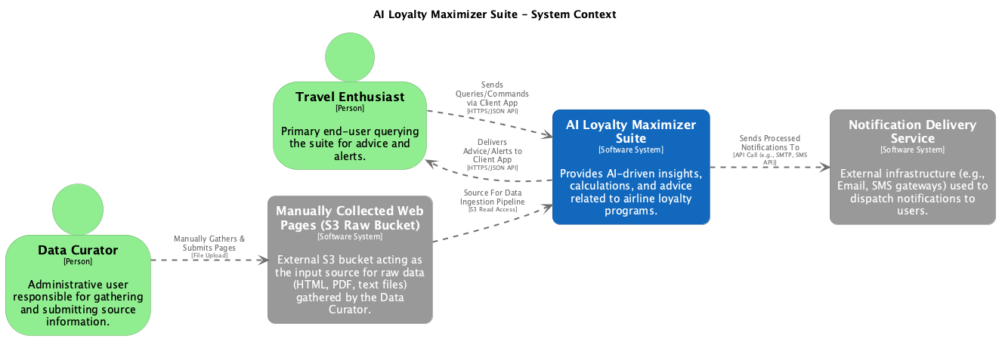

# AI Loyalty Maximizer Suite - AWS Reference Architecture

---

**🚧 This Architecture is Actively Under Development 🚧**

This reference architecture is a living document and is being actively built out. You are viewing a work in progress. New sections, details, and diagrams are being added regularly. Your understanding and patience are appreciated! Check back often for updates.

---

## Copyright and Usage

© 2025 Brian Fisher. All Rights Reserved.

The content of this repository, including all architectural documents, diagrams, and descriptions, is proprietary and shared for portfolio review and demonstration purposes only. You are welcome to view and discuss this work in that context.

No part of this repository may be reproduced, distributed, copied, or used for any commercial purposes, or to create derivative works, without the explicit prior written permission of the author.

---

## Overview

Welcome to the **AI Loyalty Maximizer Suite** repository! This project presents a comprehensive reference architecture for a conceptual, AI-first application designed for airline travel enthusiasts. The suite aims to provide intelligent, conversational assistance for:

1.  **Award Travel Optimization:** Helping users find the best ways to redeem their rewards currency (miles/points) for flights.
2.  **Revenue Flight Earnings Calculation & Crediting Advisor:** Assisting users in calculating the rewards (miles/points) and elite-qualifying metrics they will earn from paid flights, and advising on the optimal frequent flyer program for crediting.

## Purpose

This repository serves as a **portfolio piece and a detailed architectural blueprint**, showcasing the design of a sophisticated, cloud-native application built primarily on Amazon Web Services (AWS) managed services. It demonstrates advanced concepts in AI application development, solution architecture, data engineering, and cloud engineering.

The focus is on the architectural design, decision-making processes, and integration of modern technologies to solve a complex, real-world-inspired problem, including intelligent automation for knowledge base creation.

## Key Features & Technologies Showcased

* **Artificial Intelligence (AI):** Core of the solution, underpinning all intelligent capabilities.
* **End-to-End AI Solution Lifecycle Consideration:** Architectural design encompasses data ingestion and processing, model utilization (LLMs), deployment on AWS, and conceptual considerations for future model training/evaluation.
* **Large Language Models (LLMs) & Natural Language Processing (NLP):**
  * Serving as the primary orchestrator for user interaction (NLP) and tool invocation, leveraging models via Amazon Bedrock.
  * Utilized for advanced NLP-driven information extraction from diverse, semi-structured source documents (web pages, PDFs) to populate the knowledge base.
* **Advanced Machine Learning Capabilities (Conceptual):** Includes architectural considerations for potential future enhancements such as fine-tuning LLMs or training specialized models (e.g., with PyTorch, TensorFlow on Amazon SageMaker) for optimized domain-specific tasks.
* **Model Context Protocol (MCP) & Agentic Architecture:** Utilizing LLMs as orchestrating agents and specialized tools/functions as worker agents to perform specific tasks and enable complex behaviors.
* **GraphRAG (Retrieval Augmented Generation with Knowledge Graphs):** Employing graph databases (e.g., Amazon Neptune) combined with RAG techniques for contextual understanding and accessing interconnected airline loyalty data.
* **Intelligent Data Ingestion & ETL Pipeline with OCR:**
  * Automated processing of manually gathered source documents (HTML, PDF, text).
  * **Amazon S3:** Landing zone for raw and processed data.
  * **Amazon Textract:** For **OCR (Optical Character Recognition)** and table/form extraction from PDF/image documents.
  * **AWS Glue:** For **scalable** complex ETL, data transformation (with capabilities **akin to Apache Spark**), and applying Python-based parsing logic (including LLM integration for extraction).
  * **AWS Step Functions:** Orchestrating the multi-stage data ingestion and graph population pipeline.
  * **(Potentially) Amazon Athena:** For validating intermediate extracted data.
* **Serverless Architecture:** Prioritizing AWS Lambda, API Gateway, Step Functions, DynamoDB, and S3 for scalability, operational efficiency, and cost-effectiveness.
* **Cloud-Native on AWS:** Deep integration with a wide array of AWS managed services, demonstrating proficiency with a leading cloud platform.
* **Comprehensive Architectural Design:** Focusing on creating **robust, secure**, and scalable solutions, leveraging C4 modeling for software views, supplemented by enterprise architectural perspectives (Process, Physical/Deployment, Development).
* **DevOps & Infrastructure as Code (IaC):** Incorporating considerations for CI/CD pipelines and managing infrastructure programmatically (e.g., AWS CDK/CloudFormation), aligning with modern DevOps practices.

## Architectural Approach

The architecture detailed herein utilizes the **C4 model** ... (as previously written) ... A key aspect of the design is the **AI-driven, automated pipeline for ingesting and transforming varied source data** into a structured knowledge graph, minimizing manual data entry and enhancing adaptability.

**Platform Focus:** This reference architecture is detailed using Amazon Web Services (AWS) to provide concrete examples of managed service integration and cloud-native design. However, the core architectural patterns, logical components, and data flow principles are designed to be adaptable and could be implemented with equivalent services on other major cloud platforms such as Microsoft Azure or Google Cloud Platform (GCP).

---

## System Context

  

*Figure 1: High-level System Context diagram illustrating the AI Loyalty Maximizer Suite and its key interactions with users and external systems.*

---

## Navigating This Repository

The complete architectural documentation is extensive and organized into several files for clarity.

* **Start Here for Full Documentation:**
  * The **[Architecture Overview & Table of Contents](./docs/00_ARCHITECTURE_OVERVIEW.md)** provides a guide to the entire architectural specification and links to all detailed sections.
* **Architectural Diagrams:**
  * All diagrams (C4, AWS deployment, data flows, pipeline diagrams, etc.) are located in the [`/diagrams`](./diagrams) directory.
* **Architecture Decision Records (ADRs):**
  * Key design decisions and their rationale are documented in the [`/adr`](./adr) directory.

## Author

* **Brian Fisher**
    * GitHub: `https://github.com/bfisher313`
    * LinkedIn: `https://www.linkedin.com/in/brian-p-fisher/`

## Disclaimer

This is a conceptual portfolio project. The architecture and features described are for demonstration purposes and to showcase design thinking. While inspired by real-world airline loyalty programs, the data models and rules presented are illustrative. Any resemblance to specific, proprietary airline systems or data is coincidental.

## Contributing

As this is primarily a personal portfolio project, contributions are not actively sought at this time. However, feedback and suggestions are always welcome via Issues or direct contact.
