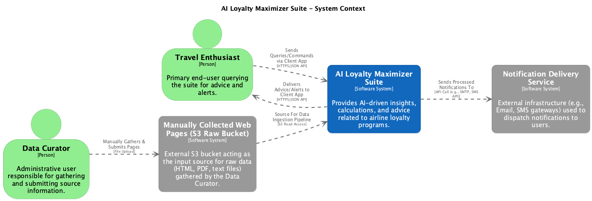
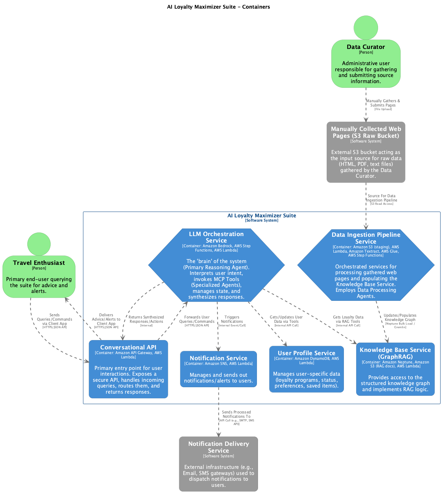

# 3. Logical Architecture (Software View)

This section details the logical software architecture of the AI Loyalty Maximizer Suite. It describes the major structural elements, their responsibilities, and how they interact at a high level, independent of specific underlying AWS service implementations (which are detailed in the Physical View). We will utilize the C4 model for its clarity in visualizing and communicating software architecture.

## 3.1. Overview & C4 Model Approach

The C4 model (Context, Containers, Components, and Code) provides a structured way to visualize software architecture at different levels of abstraction. For this document:

* **Level 1: System Context Diagram:** Illustrates how the AI Loyalty Maximizer Suite fits into its operating environment, showing its interactions with users and key external systems.
* **Level 2: Container Diagram:** Zooms into the AI Loyalty Maximizer Suite, breaking it down into its major high-level, independently deployable (or conceptually distinct) services or "containers." These are the main building blocks of the system.
* **Level 3: Component Diagrams:** Zoom into individual containers to show their key internal components or modules. This will be detailed for critical containers.
* **Level 4: Code Diagrams:** (Out of scope for this high-level architectural document) Would show the internal code structure of individual components.

This approach allows us to progressively reveal detail and understand the system from different perspectives.

## 3.2. System Context Diagram (C4 Level 1)

The System Context diagram shows the AI Loyalty Maximizer Suite as a single "black box" and its relationships with external users and systems. It defines the system's boundary and scope at the highest level of abstraction.

**Diagram:**

<p align="center">
  
</p>

**Description of System Context Diagram Elements:**

* **AI Loyalty Maximizer Suite (System):**
    * This is the core system being designed and documented.
    * Its primary purpose is to provide AI-driven insights, calculations, and advice related to airline loyalty programs.
    * It acts as the central hub for user interaction, data processing, knowledge storage, and decision-making regarding loyalty program optimization.

* **Travel Enthusiast (User Persona):**
    * Represents the primary end-users of the suite.
    * These users interact with the system by submitting natural language queries, providing details about their travel plans or loyalty program memberships, and receiving personalized advice, calculations (for earnings/redemptions), and potential alerts.

* **Data Curator (User Persona):**
    * Represents an administrative or specialized user.
    * This persona is responsible for the manual gathering of source information (e.g., web pages containing loyalty rules, airline partner details, earning charts, award tables from publicly available airline websites or documents).
    * They provide this raw information to the system's ingestion pipeline, effectively acting as the initial human-in-the-loop for populating and updating the knowledge base.

* **Manually Collected Web Pages (S3 Raw Bucket - External Input Source) (External System):**
    * This represents the conceptual upstream data source containing the raw, and potentially varied, information collected by the `Data Curator`.
    * While labeled "S3 Raw Bucket" to indicate its likely initial storage location in the AWS ecosystem for the pipeline, from the C4 Level 1 perspective, it's an external source of information that feeds into the `AI Loyalty Maximizer Suite`.
    * The suite's `Data Ingestion Pipeline Service` (a container within the suite, detailed at Level 2) reads from this external source.

* **Notification Delivery Service (External System):**
    * Represents the external infrastructure or third-party services responsible for delivering notifications (e.g., email alerts, SMS messages, or potential future newsletters) to the `Travel Enthusiast`.
    * The `AI Loyalty Maximizer Suite` would formulate the content of these notifications and then pass them to this external service for actual dispatch and delivery. This could be services like Amazon SES (for email) or Amazon SNS (for SMS) interacting with external carrier networks, or other third-party communication platforms.

## 3.3. Container Diagram (C4 Level 2) - Key Services & Responsibilities

The Container diagram zooms into the "AI Loyalty Maximizer Suite" system boundary, revealing its major logical containers. In the C4 model, a "container" is something like a separately deployable or runnable unit, or a significant, independently manageable component such as a single-page application, a server-side web application, a microservice, a database, a file system, etc. These are the high-level building blocks that collectively deliver the system's functionality.

This diagram illustrates these primary containers, their core responsibilities, and the key technological choices or paradigms associated with them at a high level. It also shows the main pathways of interaction between these containers and with the external systems/users defined in the System Context diagram.

**Diagram:**



**Container Descriptions:**

1.  **Conversational API (Container)**
  * **Description:** This container serves as the primary, secure entry point for all external user interactions with the AI Loyalty Maximizer Suite. It exposes a well-defined API that client applications (e.g., future web or mobile UIs, chatbots) will use to send user queries and receive responses. Its responsibilities include request validation, authentication/authorization, routing incoming requests to the `LLM Orchestration Service`, and formatting the final responses before sending them back to the client.
  * **Key Technologies (Conceptual):** Amazon API Gateway (for defining and managing the API endpoints, handling traffic, security), AWS Lambda (for backend request/response processing and integration logic).
  * **Primary Interactions:**
    * Receives requests from the `Travel Enthusiast` (via their client application).
    * Forwards processed queries/commands to the `LLM Orchestration Service`.
    * Receives synthesized responses/actions from the `LLM Orchestration Service`.
    * Sends formatted responses back to the `Travel Enthusiast`'s client application.

2.  **LLM Orchestration Service (Container)**
  * **Description:** This container is the central intelligence and "brain" of the system, acting as the **Primary Reasoning Agent**. It receives user queries from the `Conversational API`, interprets user intent, breaks down complex requests into manageable tasks, and determines the sequence of operations or tools (MCP Tools/Specialized Agents) needed. It manages conversational state (if required for multi-turn dialogues), invokes the appropriate tools, and synthesizes their outputs into coherent, context-aware responses or actions.
  * **Key Technologies (Conceptual):** Amazon Bedrock (for accessing and running Large Language Models), AWS Step Functions (for orchestrating complex workflows involving multiple LLM calls and tool invocations), AWS Lambda (for hosting core orchestration logic and invoking tools).
  * **Primary Interactions:**
    * Receives user queries/commands from the `Conversational API`.
    * Invokes various specialized tools/agents to:
      * Fetch user-specific data from the `User Profile Service`.
      * Retrieve loyalty program information and perform RAG operations via the `Knowledge Base Service (GraphRAG)`.
    * Sends triggers/requests to the `Notification Service`.
    * Returns synthesized responses or action directives to the `Conversational API`.

3.  **User Profile Service (Container)**
  * **Description:** This container is responsible for managing and persisting all user-specific data. This includes details of a user's loyalty program memberships, current elite statuses, rewards currency balances (if the user provides them), saved travel preferences, and potentially a history of analyzed itineraries or saved "mileage run" ideas. It provides an interface for other services to securely access and update this information.
  * **Key Technologies (Conceptual):** Amazon DynamoDB (as a scalable, flexible NoSQL database for user profiles), AWS Lambda (to implement a data access API layer for this service if needed, or for direct access by other internal services with appropriate IAM permissions).
  * **Primary Interactions:**
    * Queried by the `LLM Orchestration Service` to retrieve user data for personalization and context.
    * Updated (e.g., new program added, preferences changed) based on actions initiated by the `LLM Orchestration Service` (originating from user input via the `Conversational API`).

4.  **Knowledge Base Service (GraphRAG) (Container)**
  * **Description:** This container houses the core knowledge of the AI Loyalty Maximizer Suite. It includes the graph database representing airline loyalty programs, partner relationships, earning rules, redemption options, and fare class details. Crucially, it also encapsulates the Retrieval Augmented Generation (RAG) logic, enabling the system to retrieve relevant information from the graph (and potentially supplementary documents in S3) to provide rich context to the LLM for generating accurate and detailed answers.
  * **Key Technologies (Conceptual):** Amazon Neptune (as the graph database), Amazon S3 (for storing unstructured documents or detailed rule texts for RAG), AWS Lambda (for implementing RAG retrieval logic, graph query execution, and providing an interface to this service).
  * **Primary Interactions:**
    * Queried by specialized tools/agents (invoked by the `LLM Orchestration Service`) to fetch specific loyalty data, perform graph traversals, or retrieve contextual information for RAG.
    * Receives data updates (new rules, program changes) from the `Data Ingestion Pipeline Service`.

5.  **Data Ingestion Pipeline Service (Container)**
  * **Description:** This container comprises an orchestrated set of services responsible for the automated processing of manually gathered source information (HTML pages, PDFs, text files) to populate and maintain the `Knowledge Base Service`. It acts as a collection of **Data Processing Agents**. The pipeline includes stages for initial data validation and pre-processing, OCR (using Amazon Textract for image-based documents), advanced information extraction (leveraging LLMs via Amazon Bedrock to parse semi-structured content and identify entities/relationships like effective dates), data transformation into graph format, optional validation (e.g., using Amazon Athena on intermediate structured data), and finally, loading the data into the Neptune graph database.
  * **Key Technologies (Conceptual):** Amazon S3 (for various staging areas: raw, processed text, Textract output, LLM output, Neptune load files), AWS Lambda (for individual processing steps and triggers), Amazon Textract, AWS Glue (for complex ETL, Python-based parsing, and LLM integration for extraction), AWS Step Functions (for orchestrating the entire multi-step pipeline).
  * **Primary Interactions:**
    * Reads raw data from the `Manually Collected Web Pages (S3 Raw Bucket - External Input Source)` which is supplied by the `Data Curator`.
    * Writes processed and transformed data into the `Knowledge Base Service` (specifically, by preparing load files for Amazon Neptune or directly interacting with it).

6.  **Notification Service (Container)**
  * **Description:** This container is responsible for managing and dispatching outbound notifications and alerts to users. These could include alerts for award availability, reminders, or future newsletters. It decouples the notification logic from the core `LLM Orchestration Service`.
  * **Key Technologies (Conceptual):** Amazon SNS (Simple Notification Service) (for fanning out messages to different endpoints like email, SMS), AWS Lambda (for composing notification content and interacting with SNS).
  * **Primary Interactions:**
    * Receives triggers or notification requests from the `LLM Orchestration Service`.
    * Publishes messages to the `Notification Delivery Service (External)` (e.g., by sending an email via SES, an SMS via SNS, or interfacing with another external gateway).

## 3.4. Component Diagrams (C4 Level 3) - For Critical Containers

**[🚧 TODO: Future Iteration - Detailed Component Diagrams 🚧]**

Component diagrams provide a more detailed view by zooming into individual containers listed in the C4 Level 2 diagram. They illustrate the key internal components, modules, or classes within a container and their interactions.

Developing detailed C4 Level 3 Component diagrams for each container is an extensive task. For the initial version of this architectural document, this section outlines the intent, and specific component diagrams for critical containers (such as the `LLM Orchestration Service` and the `Data Ingestion Pipeline Service`) will be developed in future iterations.

* **LLM Orchestration Service - Components:** (To be detailed in a future iteration. Will include components like Intent Recognizer, Dialogue Manager, MCP Invoker, Response Synthesizer.)
* **Data Ingestion Pipeline Service - Components:** (To be detailed in a future iteration. Will include components for different stages like Page Fetch/Pre-processing, Textract Interaction, LLM-based Information Extractor, Validation Logic, Graph Transformation.)

## 3.5. Interface Definitions (Model Context Protocol - MCP Tools)

The AI Loyalty Maximizer Suite relies on a **Model Context Protocol (MCP)** that defines how the central `LLM Orchestration Service` (acting as a Primary Reasoning Agent) interacts with specialized tools or worker agents. These tools are self-contained units of functionality that perform specific tasks, access data from other services, or execute business logic when invoked by the LLM Orchestrator.

These tools are conceptually invoked with a defined request structure and are expected to return a response in a defined structure. In the AWS implementation, these would typically be realized as AWS Lambda functions, orchestrated via AWS Step Functions and triggered by the LLM Orchestration Service.

Below are conceptual definitions for some of the key MCP tools:

1.  **Tool: `get_user_profile`**

    **Description:**
    Retrieves the stored profile information for a given user, including their enrolled loyalty programs, current elite statuses, and any saved preferences or reward balances.

    **Invoked by:**
    `LLM Orchestration Service` (when personalization or user-specific context is needed).

    **Interacts with (Data Source):**
    `User Profile Service` (e.g., querying Amazon DynamoDB).

    **Request (Conceptual JSON):**
    ```json
    {
      "userId": "string"
    }
    ```

    **Response (Conceptual JSON):**
    ```json
    {
      "userId": "string",
      "loyaltyPrograms": [
        {
          "programId": "string", // e.g., "UA_MileagePlus", "AA_AAdvantage"
          "programName": "string", // e.g., "United MileagePlus"
          "statusTier": "string",  // e.g., "Gold", "Platinum"
          "redeemableBalance": {
            "amount": "integer",
            "currencyName": "string" // e.g., "Miles", "Points"
          },
          "eliteQualifyingMetrics": [
            {
              "metricName": "string", // e.g., "PQP", "LP", "EQM"
              "currentValue": "integer",
              "unit": "string" // e.g., "Points", "Miles"
            }
          ]
        }
      ],
      "preferences": {
        "preferredAirlines": ["string"],
        "preferredAlliances": ["string"],
        "homeAirport": "string"
        // ... other preferences
      }
    }
    ```

2.  **Tool: `calculate_flight_earnings`**

    **Description:**
    Calculates the potential redeemable rewards currency (miles/points) and elite-qualifying metrics for a specific flight itinerary across one or more target loyalty programs. **The tool derives flight distances using geographic coordinates of origin and destination airports stored in the Knowledge Base Service.**

    **Invoked by:**
    `LLM Orchestration Service` (when a user asks "how much will I earn for this flight?").

    **Interacts with (Data Source):**
    `Knowledge Base Service (GraphRAG)` (to retrieve earning rules, fare class multipliers, partner agreements, **and airport coordinates**).

    **Request (Conceptual JSON):**
    ```json
    {
      "flightItinerary": {
        "segments": [
          {
            "marketingCarrier": "string", // e.g., "UA"
            "operatingCarrier": "string", // e.g., "LH"
            "flightNumber": "string",
            "originAirport": "string", // e.g., "JFK" - Used to fetch coordinates
            "destinationAirport": "string", // e.g., "FRA" - Used to fetch coordinates
            "fareClass": "string" // e.g., "K"
            // "distanceMiles": "integer" <-- This field is REMOVED; system calculates it
          }
        ],
        "ticketPrice": { // Optional, for revenue-based programs or where spend is a factor
          "baseFare": "float",
          "carrierImposedSurcharges": "float",
          "taxesAndAirportFees": "float",
          "totalFare": "float",
          "currency": "string" // e.g., "USD"
        }
      },
      "userProfileContext": { // Optional: relevant parts of user's profile, e.g., status for bonuses
        "userId": "string",
        "statusTiers": [
          { "programId": "string", "tier": "string" }
        ]
      },
      "targetLoyaltyPrograms": ["programId1", "programId2"] // List of program IDs to calculate for
    }
    ```

    **Response (Conceptual JSON):**
    ```json
    {
      "earningOptions": [
        {
          "programId": "string",
          "programName": "string",
          "calculatedDistanceMiles": "integer", // Optional: Include calculated distance for transparency
          "redeemableCurrency": {
            "amountEarned": "integer",
            "type": "string" // e.g., "Miles", "Points"
          },
          "eliteQualifyingMetrics": [
            {
              "name": "string", // e.g., "PQP", "LP", "EQM"
              "valueEarned": "integer",
              "unit": "string"
            }
          ],
          "calculationNotes": ["string"] // e.g., "Includes 25% elite bonus", "Fare class K earns 50% of calculated distance", "Earnings based on base fare + carrier surcharges"
        }
      ],
      "summaryAdvice": "string" // Optional: LLM-generated summary or context for next step
    }
    ```

3.  **Tool: `find_award_availability_options`**

    **Description:**
    Identifies potential award travel options based on user criteria. This tool leverages the `Knowledge Base Service` for program rules, partnerships, and conceptual award charts/sweet spots. *Note: In this conceptual architecture, it does not perform live searches on airline systems but provides options based on the knowledge graph.*

    **Invoked by:**
    `LLM Orchestration Service` (when a user asks "find me award flights...").

    **Interacts with (Data Source):**
    `Knowledge Base Service (GraphRAG)`.

    **Request (Conceptual JSON):**
    ```json
    {
      "origin": "string", // Airport code or city
      "destination": "string", // Airport code or city
      "travelDates": {
        "departureDate": "YYYY-MM-DD", // Can also support flexible date ranges
        "returnDate": "YYYY-MM-DD" // Optional
      },
      "cabinClass": "string", // e.g., "Economy", "Business", "First"
      "numberOfTravelers": "integer",
      "userRewardsBalances": [ // From user profile or provided
        { "programId": "string", "balance": "integer" }
      ],
      "preferences": {
        "maxStops": "integer",
        "preferredAlliances": ["string"],
        "considerPointTransfers": "boolean"
      }
    }
    ```

    **Response (Conceptual JSON):**
    ```json
    {
      "awardOptions": [
        {
          "optionId": "string",
          "description": "string", // e.g., "Lufthansa Business Class via Frankfurt on Star Alliance"
          "segments": [
            { "airline": "string", "flightNumber": "string", "cabin": "string"}
          ],
          "estimatedCost": {
            "amount": "integer",
            "currencyName": "string", // e.g., "Miles", "Points"
            "programId": "string" // Program to redeem from
          },
          "taxesAndFeesEstimate": {
            "amount": "float",
            "currency": "string" // e.g., "USD"
          },
          "transferPartnersPotentiallyNeeded": [ // If points transfer is an option
            { "fromProgram": "string", "toProgram": "string", "estimatedPointsToTransfer": "integer" }
          ],
          "keyRulesOrBenefits": ["string"], // e.g., "Utilizes a known sweet spot for this route"
          "confidence": "string" // e.g., "High (based on typical availability patterns)" - as it's not live
        }
      ],
      "summaryAdvice": "string" // e.g., "Option 1 offers the best points value."
    }
    ```

4.  **Tool: `extract_loyalty_info_from_document`** (Primarily used by Data Ingestion Pipeline Service)

    **Description:**
    This specialized tool is invoked by the `Data Ingestion Pipeline Service`. It takes processed textual or structured content (e.g., from HTML, Textract JSON output) from a single gathered document and uses an LLM (via Amazon Bedrock) to extract specific loyalty program information (rules, earning rates, validity dates, partner details, etc.) according to a predefined target schema.

    **Invoked by:**
    `Data Ingestion Pipeline Service` (specifically, its Glue ETL/Step Functions orchestrator).

    **Interacts with (AI Service):**
    Amazon Bedrock (LLM).

    **Request (Conceptual JSON):**
    ```json
    {
      "documentContent": "string", // The text/structured content to analyze
      "documentSourceIdentifier": "string", // e.g., original URL, S3 key of the raw file
      "extractionTargetSchema": { // Defines what information to look for
        "type": "object",
        "properties": {
          "airlineName": { "type": "string" },
          "partnerAirline": { "type": "string" },
          "fareClassDetails": { 
            "type": "array", 
            "items": { 
              "type": "object", 
              "properties": { 
                "classCode": {"type": "string"}, 
                "earningRate": {"type": "string"},
                "eliteMetricRate": {"type": "string"}
              } 
            }
          },
          "ruleEffectiveDate": { "type": "string", "format": "date" },
          "ruleExpirationDate": { "type": "string", "format": "date" },
          "conditionsAndNotes": { "type": "string" }
          // ... other fields relevant to the document type
        }
      }
    }
    ```

    **Response (Conceptual JSON):**
    ```json
    {
      "extractedData": {
        // JSON object conforming to the extractionTargetSchema, populated by the LLM
        "airlineName": "Example Air",
        "fareClassDetails": [{"classCode": "K", "earningRate": "50% of distance flown"}],
        "ruleEffectiveDate": "2024-01-01",
        // ...
      },
      "extractionConfidence": "float", // e.g., 0.85
      "processingErrorsOrWarnings": ["string"] // Any issues encountered during extraction
    }
    ```

---
*This page is part of the AI Loyalty Maximizer Suite - AWS Reference Architecture. For overall context, please see the [Architecture Overview](./00_ARCHITECTURE_OVERVIEW.md) or the main [README.md](../README.md) of this repository.*